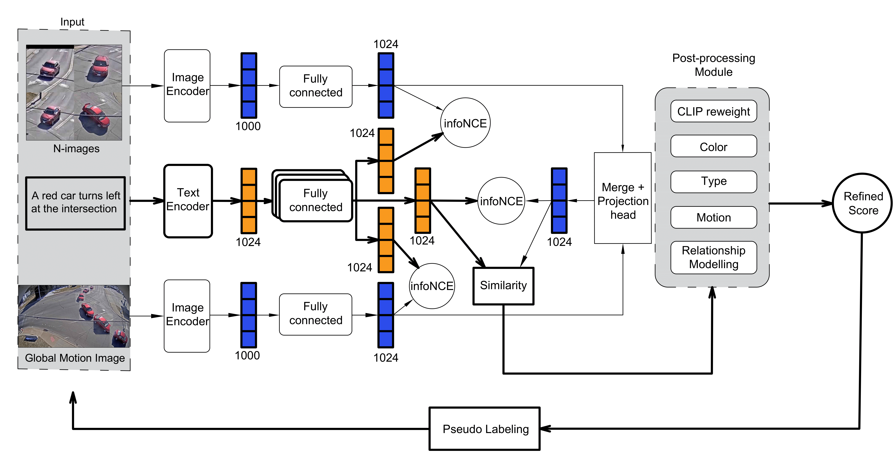

# AI City 2023: Comprehensive Visual Features and Pseudo Labeling for Robust Natural Language-based Vehicle Retrieval

<p align="center">
 
</p>

---
## Scoreboard
The 3nd Place Submission to AICity Challenge 2023 Tracked-Vehicle Retrieval by Natural Language Descriptions

| **Rank**            |       **Team ID**       |         **Team name**          |             **MRR Score**              |
|:--------------------:|:-----------------------------:|:----------------------------:|:---------------------------------:|
| 1 |   9   |   HCMIU-CVIP   |   0.8263    |
| 2 |   28  |      IOV       |   0.8179    |
| **3** |   **85**  | **AIO-NLRetrieve (Ours)** |   **0.4795**   |
| 4 |   151 |    AIO2022     |   0.4659    |
| 5 |   76  |    DUT_ReID    |   0.4392    |

---
## Prepare
-  Preprocess the dataset to prepare `frames, motion maps, video clips`

` scripts/extract_vdo_frms.py` is a Python script that is used to extract frames.

` scripts/get_motion_maps.py` is a Python script that is used to get motion maps.

` scripts/get_clip_maps.py` is a Python script that is used to get video clips.

` scripts/extract_clip_feature_tracks.ipynb`  is a Python script that is used to get clip features

- You can download the necessary files [here](https://github.com/anminhhung/AI-City-2023-Track2/releases/tag/v0.0)

The directory structures in data is as follows
```
data/
└── AIC23_Track2_NL_Retrieval/
    └── data/
        ├── clip_feats/
        ├── data/
        │   ├── bk_map/
        │   ├── motion_heatmap/
        │   └── motion_map_iou/
        ├── train/
        │   ├── S01/
        │   ├── S03/
        │   ├── S04/
        ├── validation/
        │   ├── S02/
        │   ├── S05/
        ├── train-tracks_nlpaug.json    
        ├── train-tracks_nlpaug_2.json  
        ├── train-tracks_nlpaug_3.json
        └── ...
```

---
## Train
The configuration files are in `configs` and train different models by (set up the right data path first):

```
bash run/single_baseline_aug1.sh
bash run/single_baseline_aug1_plus.sh
bash run/single_baseline_aug2.sh
bash run/circle_loss.sh
bash run/view_triplet_hard.sh
bash run/dual_baseline_aug3.sh
```

## Eval
You can also change the `RESTORE_FROM` in your configuration file to checkpoints, and load checkpoints to eval (download the checkpoints first).
Take `dual_baseline_aug1` as an example:

```
bash run/eval_only.sh
```

## Ensemble 
Change the `RESTORE_FROM` in your configuration file and extract the embeddings

In addition, acquire the car and text features used in short-distance modeling by running the following code:

1. Run `python3 scripts/get_location_info.py` to generate location information for each camera, which will be used in our post-processing stage.

2. Run `python3 scripts/get_relation_info.py` to generate relationship features for test tracks, which will be used in our post-processing stage.

```
base run/submit.py
```

## Post processing

Copy the `sim_mat.npy` file generated from previous step and paste it to `post_process_module/post_process/post-process-part1/sim_mat` folder.

run the `post_process.py` files in 2 post procesing modules. See [post_processing module](post_process/post_process/README.md) for more details.